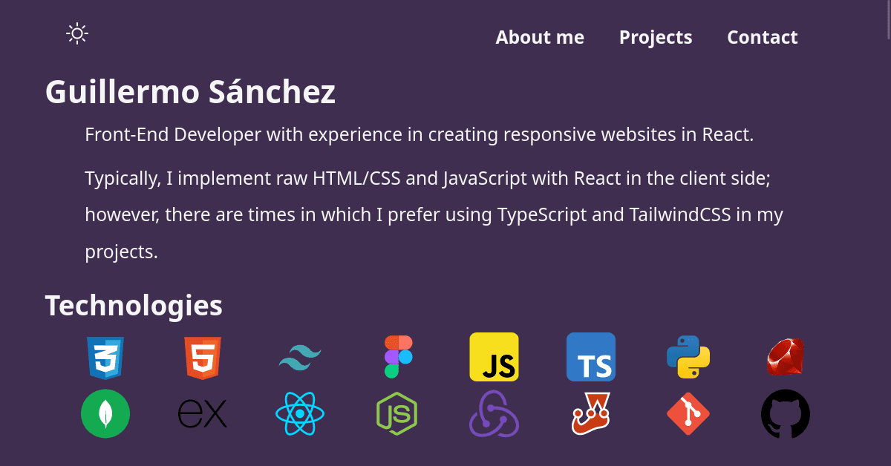

# Guillermo Sánchez's portfolio

## Tabla de contenidos

- [General Description](#general-description)
  - [Screenshot](#screenshot)
  - [Links](#links)
- [Built with](#built-with)
- [Useful resources](#useful-resources)
- [Contact](#contacto)

## General description

Hello! This is my portfolio in which I showcase all of the projects I have been working on.

### Screenshot

  

    
  

### Links

- Repository URL: [https://github.com/Guille-Sanchez/portfolio](https://github.com/Guille-Sanchez/portfolio)
- PoliMovil site URL: [https://guillermo-portfolio.netlify.app/](https://guillermo-portfolio.netlify.app/)

### Built with
- Vite
- [React](https://reactjs.org/) - JS library
- TypeScript

### Useful resources

- [React Icons](https://reactsvgicons.com/) - Recurso para la provisión de iconos.
- [Svg-Repo](https://www.svgrepo.com/) - Recurso para la provisión de svg.

## Contact

- LinkedIn - [Guillermo Sanchez](https://www.linkedin.com/in/guillermo-sanchez-developer/)
